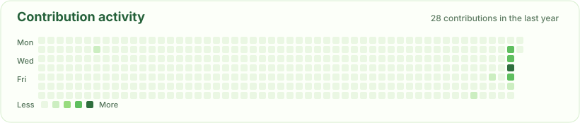
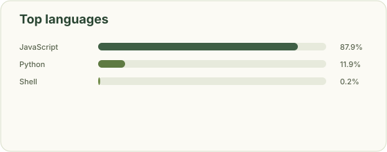

 

  

<code>Python</code> · <code>PyTorch</code> · <code>Transformers</code> · <code>SQL</code> · <code>LLM Reasoning</code> · <code>Evaluation</code>

  

<a href="#中文">中文</a> &nbsp;·&nbsp; <a href="#english">English</a>

---

## 🌿 你好，我是姜慧 · Hi, I'm Hui Jiang

目前在 **中国科学院大学人工智能学院 / 中国科学院自动化研究所** 攻读硕士学位，从事大语言模型推理与评测相关研究。此前拥有三年多产业级海量异构数据分析与建模经验。

> 💡 **核心关切 · Core Focus**  
> **额外推理计算何时真正产生价值？我们能否在推理过程中提前判定与自适应分配？**  
> *When does extra inference compute genuinely help, and how can we evaluate intermediate states to allocate test-time compute wisely?*

---

### 🧠 我在思考 · Exploring

- **Test-Time Computation**：自适应推理深度与计算预算动态分配机制
- **System 1 & 2 Synergistic Reasoning**：直觉生成（Fast）与形式化分析（Slow）的协同推理范式
- **Symbolic-Augmented Reasoning (LoT)**：结合符号逻辑、约束求解与中间状态验证的增强推理
- **Reasoning State Evaluation**：局部推理状态的价值评估（Local Value）、有限步前瞻与选择性干预
- **Mechanistic Interpretability**：逻辑推理相关神经元定位与模型内部功能组织机理
- **Agent & Reasoning Evaluation**：面向推理与执行全过程的可审计评测

### 🌱 我在构建 · Building

- **推理预算与状态评估**：探索局部推理价值（Local Value）与选择性介入（Selective Intervention）
- **可信 Agent 运行时**：把 Generation、Verification、Control 与 Observability 解耦的验证型架构
- **趣味 Vibe Coding**：从真实生活微小痛点出发，打造优雅轻盈的实用产品

---

## ✦ 精选项目 · Selected Work

### 🔬 科研与推理 · Research & Reasoning

<table width="100%">
  <tr>
    <td width="50%" valign="top">
      <h3>🧠 <a href="https://openreview.net/pdf?id=RigeZLi611">More Thinking Is Not Always Better</a></h3>
      
<strong>第一作者 · NLPCC 录用</strong>

      
探究 test-time reasoning 中的推理深度与计算分配：论证了更多推理并不必然带来准确率提升，核心在于将额外计算自适应分配给真正需要的复杂实例。

      
      
      
    </td>
    <td width="50%" valign="top">
      <h3>🔬 <a href="https://www.jos.org.cn/josen/article/pdf/7704">大语言模型中的逻辑神经元</a></h3>
      
<strong>第一作者 · 《软件学报》录用</strong>

      
通过 gradient-based localization 与 inference-time intervention，深入剖析逻辑推理关联的 FFN 功能单元，揭示不同逻辑子能力间的共享与专有组织机制。

      
      
      
    </td>
  </tr>
  <tr>
    <td colspan="2" valign="top">
      <h3>🧩 RoTFuse</h3>
      
<strong>Research in Progress</strong>

      
探索 test-time reasoning 过程中的局部推理状态评估（Local Reasoning State Evaluation）：评估哪个中间推理状态更具扩展价值，聚焦 local value、limited lookahead 与 selective intervention。

      
      
      
    </td>
  </tr>
</table>

### 🛠️ 系统与实践 · Systems & Builds

<table width="100%">
  <tr>
    <td width="50%" valign="top">
      <h3><a href="https://github.com/JiangHui0203/veriagent">🧭 VeriAgent</a></h3>
      
<strong>Verifiable Agent Runtime</strong>

      
探索可验证、可恢复、可审计的 Agent runtime：将 generation、verification、control 与 observability 解耦拆分，并在逻辑推理与数据分析两类典型任务中落地。

      
      
      
    </td>
    <td width="50%" valign="top">
      <h3><a href="https://github.com/JiangHui0203/NiceRice">🍚 NiceRice · 有时好饭</a></h3>
      
<strong>Vibe Coding · 微信小程序</strong>

      
从真实生活需求出发，在忙碌日程、物理距离、天气状况、就餐偏好与朋友时间之间，寻找一个刚刚好的用餐安排与生活秩序。

      
      
      
    </td>
  </tr>
</table>

---

## 💼 工作经历 · Experience

- **厦门市美亚柏科信息股份有限公司（北京分公司）** — 数据分析师 · *2021.04 — 2024.08*  
  长期基于 SQL 处理百万至亿级多源异构数据，深度参与复杂关系图谱发现、跨域身份数据融合与业务数据分析建模，全面覆盖需求拆解、数据清洗治理、规则策略设计、验证评估与最终交付。

## 🎓 教育背景 · Education

- **中国科学院大学 · 人工智能学院 / 中国科学院自动化研究所** — *2024 — 2027*  
  硕士在读 · 聚焦大模型推理机制、计算预算分配与评测
- **郑州轻工业大学 · 数学与应用数学** — *2017 — 2021*  
  理学学士 · 本科毕业论文获 **河南省优秀学士学位论文**

---

## 🌿 English Overview

I am currently a Master's student at the **School of Artificial Intelligence, University of Chinese Academy of Sciences (UCAS)** / **Institute of Automation, Chinese Academy of Sciences (CASIA)**, researching Large Language Model (LLM) reasoning, test-time compute, and evaluation. Prior to graduate school, I worked for over three years as an industry data analyst tackling multi-source heterogeneous big data.

> 💡 **Core Research Thesis**  
> **When does extra inference computation genuinely yield value? Can we evaluate intermediate reasoning states and allocate test-time compute adaptively on the fly?**

### 🧠 Research Interests

- **Test-Time Computation & Budgeting**: Dynamic compute allocation and adaptive reasoning depth.
- **System 1 & 2 Synergistic Reasoning**: Combining intuitive generation (Fast) with formal, structured verification (Slow).
- **Symbolic-Augmented Reasoning (LoT)**: Augmenting reasoning trajectories with symbolic logic, formal solvers, and state validation.
- **Reasoning State Evaluation**: Quantifying the continuation value of intermediate states (local value) with selective intervention.
- **Mechanistic Interpretability**: Dissecting logic-specific functional neurons (FFNs) and uncovering internal model organization.
- **Auditable Agent Evaluation**: Verifiable evaluation benchmarks for multi-step reasoning and execution runtimes.

### ✦ Selected Publications & Projects

#### 🔬 Publications & Research
- **More Thinking Is Not Always Better** (First Author · Accepted by **NLPCC**)  
  *Investigates test-time reasoning depth and compute allocation, demonstrating that extra thinking does not monotonically improve accuracy, and that compute must be dynamically routed to instances that truly benefit.*  
  [📄 [OpenReview PDF](https://openreview.net/pdf?id=RigeZLi611)]

- **Logic Neurons in Large Language Models (大语言模型中的逻辑神经元)** (First Author · Accepted by **Journal of Software / 《软件学报》**)  
  *Leverages gradient-based localization and activation intervention to isolate logic-associated FFN functional units, revealing shared vs. task-specific organizational mechanisms across diverse logical reasoning capabilities.*  
  [📄 [JOS Article PDF](https://www.jos.org.cn/josen/article/pdf/7704)] &nbsp;|&nbsp; [🔗 [DOI: 10.13328/j.cnki.jos.007704](https://doi.org/10.13328/j.cnki.jos.007704)]

- **RoTFuse** (Research in Progress)  
  *Evaluating intermediate reasoning states to determine where test-time computation should be expanded or pruned.*

#### 🛠️ Systems & Builds
- [**🧭 VeriAgent**](https://github.com/JiangHui0203/veriagent) — *A verifiable, recoverable, and auditable Agent runtime architecture decoupling generation, verification, control, and observability.*
- [**🍚 NiceRice**](https://github.com/JiangHui0203/NiceRice) — *A WeChat Mini-Program optimizing everyday meal arrangements under realistic multi-constraint scheduling (Vibe Coding).*

---

## 🧰 技术栈 · Toolbox

  

`Transformers` · `PyTorch` · `CUDA` · `OpenPAI` · `LLM Evaluation` · `Experiment Design` · `Trajectory Analysis`

---

## 🌱 GitHub 数据看板 · GitHub Activity

  

---

### when to think · where to think · when to stop

  

Reason carefully · Evaluate rigorously · Build things that work

